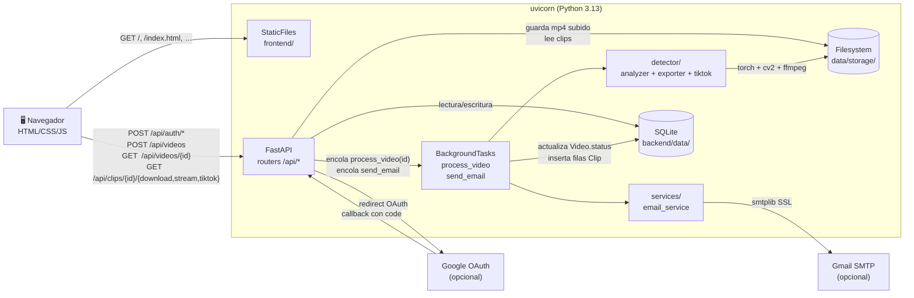
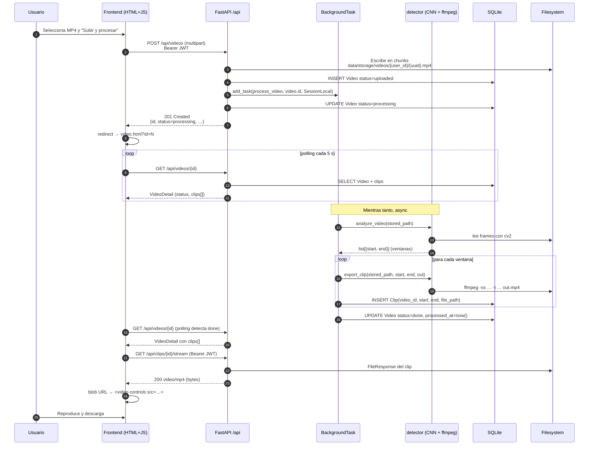
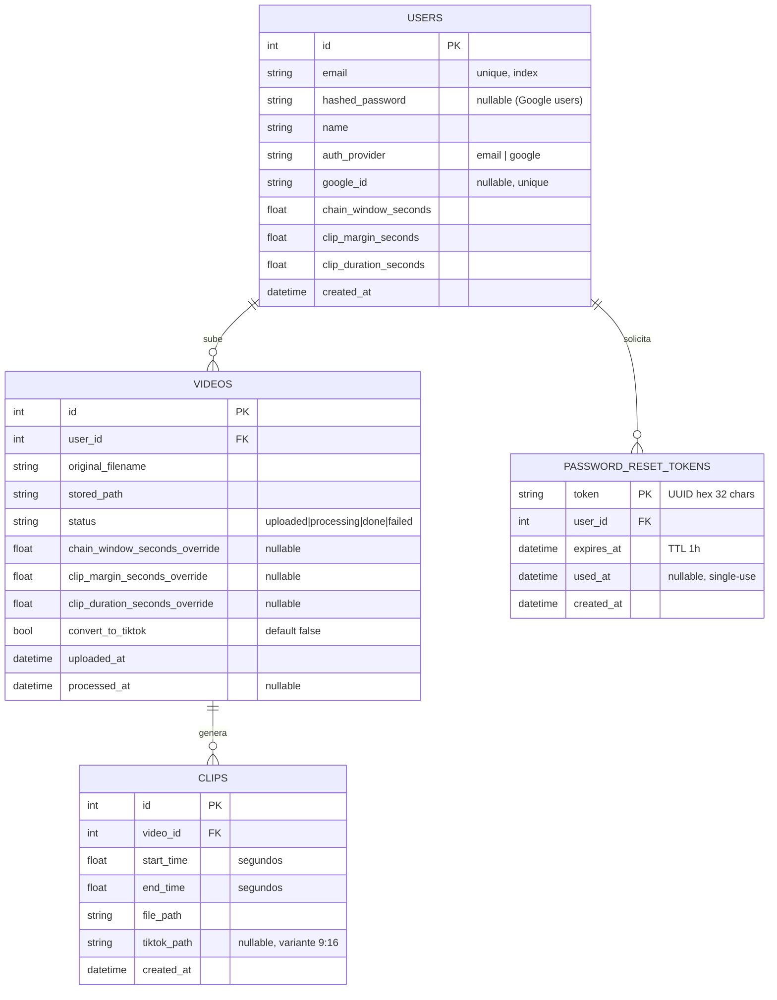
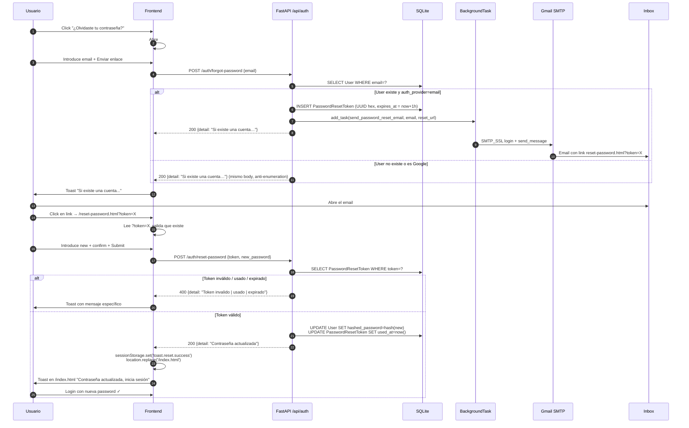

# Arquitectura — ClipCatcher

> Visión técnica del MVP entregable: componentes, flujo end-to-end, modelo
> de datos y límites del diseño actual frente a la arquitectura objetivo.
> Para conocer **qué** quedó fuera y **por qué**, ver
> [`trabajo_futuro.md`](trabajo_futuro.md).

---

## 1. Vista general

ClipCatcher es una aplicación web monolítica donde un único proceso
`uvicorn` sirve la API REST y los assets del frontend. El procesamiento
de vídeo ocurre dentro del mismo proceso, en segundo plano, mediante
`BackgroundTasks` de FastAPI. Dos integraciones externas opcionales:
Google OAuth (vía `authlib`) para login, y SMTP de Gmail para enviar
emails de recuperación de contraseña.



---

## 2. Flujo end-to-end de una subida

Secuencia desde que el usuario arrastra un MP4 hasta que reproduce los
clips generados.



Tiempo medido sobre un clip de 30 s a 720p (CPU, sin GPU):

- Subida del MP4 (13 MB en local): **~0.09 s**.
- `analyze_video`: **~2.4 s** (ResNet-18 a 1 frame/s con `lru_cache` del modelo).
- `export_clip` (ffmpeg, libx264 preset `fast` + AAC): **~5.5 s**.
- Total end-to-end (subida → `done` con clip horizontal generado): **~7 s**.

Si el usuario marcó el checkbox **"Generar también versión TikTok"**
en la subida, tras `export_clip` el processor llama además a
`convert_to_tiktok(clip_path, clip_path_tiktok)` por cada ventana. Es
otra pasada de ffmpeg con `filter_complex` (crop + scale + alphamerge
+ overlay) que añade **~9 s** sobre un clip de 30 s. La conversión es
best-effort: si falla, `Clip.tiktok_path` queda `NULL` pero el clip
horizontal sigue exportado y persistido. El usuario verá un solo
botón de descarga en lugar de dos.

---

## 3. Modelo de datos

Cuatro tablas en SQLite, sin migraciones (`Base.metadata.create_all`
en el evento `lifespan`).



Las relaciones se cargan vía
`relationship(... cascade="all, delete-orphan")`, así un `User` borrado
se lleva sus `Video` y `PasswordResetToken`, y cada `Video` borrado se
lleva sus `Clip` (también del filesystem: `delete_video` limpia `.mp4`
y variantes `_tiktok.mp4` con `unlink(missing_ok=True)`).

### Settings del detector y override por vídeo

Las tres columnas `chain_window_seconds`, `clip_margin_seconds` y
`clip_duration_seconds` del `User` son los valores **por defecto** del
detector para ese usuario. Las tres columnas `*_override` del `Video`
son **opcionales**: si vienen NULL, `processor.py` usa los del User; si
vienen con valor, sobrescriben solo para ese vídeo. La precedencia
es `Video.X_override > User.X > constante interna del detector`.

### Auth multi-proveedor

`User.auth_provider` es un string discriminador (`"email"` o
`"google"`). Los usuarios de Google tienen `hashed_password = NULL`,
lo que permite a `auth.login` rechazarlos con un mensaje claro
("esta cuenta usa Google para iniciar sesión") en lugar de un
genérico "credenciales inválidas". `User.google_id` guarda el `sub`
estable que devuelve OIDC, indexado y único.

---

## 4. Componentes del backend

### `backend/app/`

- **`main.py`** — Punto de entrada. Crea la app FastAPI, registra
  middlewares (`SessionMiddleware` con `app_secret_key` para el state
  CSRF de OAuth, CORS abierto en dev), declara el `lifespan` que
  crea las carpetas y las tablas, registra los routers bajo `/api`,
  expone `/health` y `/api/health`, registra el catch-all
  `/api/{full_path:path}` que devuelve 404 JSON, registra un
  exception handler que sirve `404.html` para rutas no-`/api`, y
  monta `StaticFiles` en `/`.
- **`core/config.py`** — `Settings(BaseSettings)` con lectura de
  `backend/.env` y caché vía `lru_cache`. Campos: secrets de app y
  JWT, `MAX_UPLOAD_BYTES`, `FRONTEND_URL`, credenciales OAuth Google
  opcionales, credenciales SMTP opcionales.
- **`core/security.py`** — `hash_password` (bcrypt), `verify_password`,
  `create_access_token`, `decode_token`.
- **`core/deps.py`** — `oauth2_scheme` y `get_current_user(token, db)`
  que decodifica el JWT, busca el `User` y lanza 401 si falla.
- **`db/session.py`** — Engine SQLAlchemy con
  `connect_args={"check_same_thread": False}` para SQLite,
  `SessionLocal` como `sessionmaker`, helper `get_db()`.
- **`models/`** — `User`, `Video`, `Clip`, `PasswordResetToken` con
  tipado moderno (`Mapped[…]` + `mapped_column(...)`).
- **`schemas/`** — `UserCreate`, `UserOut`, `UserProfileUpdate`,
  `PasswordChangeRequest`, `UserSettings`, `UserSettingsUpdate`,
  `UserStats`, `ActivityEvent`, `Token`, `VideoOut`, `VideoDetail`,
  `ClipOut` (con `field_validator` que enmascara `tiktok_path` real
  a `"available"`/`None`), `GlobalStats`.
- **`api/auth.py`** — `POST /auth/register`, `POST /auth/login`
  (OAuth2 password flow), `POST /auth/forgot-password` (anti-enumeration:
  200 siempre), `POST /auth/reset-password` (consume token UUID
  single-use con TTL 1h).
- **`api/oauth.py`** — `GET /auth/google/login` (redirect a Google
  con state firmado en cookie de sesión), `GET /auth/google/callback`
  (intercambia code por tokens, valida `id_token`, resuelve User
  por `google_id` o crea nuevo, emite JWT propio), `GET
  /auth/google/available` (consulta si OAuth está configurado para
  que el frontend oculte el botón si no).
- **`api/users.py`** — `GET /users/me`, `PATCH /users/me` (perfil),
  `PUT /users/me/password` (cambio de contraseña, solo cuentas
  email+password), `GET`/`PUT /users/me/settings` (defaults del
  detector), `GET /users/me/stats` (agregados del usuario), `GET
  /users/me/activity` (timeline de eventos recientes).
- **`api/videos.py`** — `POST /videos` (multipart, escritura en
  chunks de 1 MiB con corte por `MAX_UPLOAD_BYTES`, acepta 3 form
  params opcionales para overrides del detector más
  `convert_to_tiktok`), `GET /videos`, `GET /videos/{id}`,
  `DELETE /videos/{id}` (cascade ORM + limpieza de ficheros en
  disco).
- **`api/clips.py`** — `GET /clips/{id}/download` (16:9 con
  attachment), `GET /clips/{id}/stream` (inline para `<video>` con
  Range nativo), `GET /clips/{id}/tiktok` (variante 9:16, 404 si
  no fue generada). Helper `_get_owned_clip` centraliza
  autorización (404 unificado para "no existe / no es tuyo") y
  comprobación de archivo en disco (410 Gone si la fila existe pero
  el archivo se ha perdido).
- **`api/stats.py`** — `GET /stats/global` (sin auth, agregados
  anónimos para la landing pública).
- **`services/processor.py`** — `process_video(video_id, db_factory)`
  orquesta `analyze_video` + `export_clip` por ventana, opcionalmente
  llama a `convert_to_tiktok` por clip si `Video.convert_to_tiktok`
  está activo (best-effort: si falla, `tiktok_path` queda NULL pero
  el clip horizontal se guarda). Gestiona transiciones de estado
  (`uploaded → processing → done|failed`) y nunca propaga
  excepciones (las marca `failed`).
- **`services/email_service.py`** — `send_password_reset_email(to,
  url)` con `smtplib.SMTP_SSL` + `ssl.create_default_context`.
  Best-effort: si `SMTP_USER`/`PASSWORD` no están configurados o si
  el envío falla, loggea y retorna sin propagar.

### `backend/detector/`

- **`analyzer.py`** — `analyze_video(path, *,
  chain_window_seconds=None, clip_margin_seconds=None,
  clip_duration_seconds=None) -> list[tuple[float, float]]`. Carga
  `kill_detector.pt` con `lru_cache`, recorta el ROI del killfeed
  (esquina superior derecha, coords relativas), procesa 1 frame por
  segundo con la CNN binaria, y agrupa detecciones consecutivas
  dentro de `chain_window_seconds` en una sola ventana. Los kwargs
  opcionales permiten override por llamada; si vienen `None` cae a
  los valores del `config.json`.
- **`exporter.py`** — `export_clip(path, start, end, out)`. Función
  pura: invoca `ffmpeg` por `subprocess` con `libx264 + AAC`, sin
  estado global.
- **`tiktok_exporter.py`** — `convert_to_tiktok(input, output)`.
  Pipeline ffmpeg en una sola pasada con `filter_complex`: crop del
  gameplay 640×720 en `(340, 0)` → scale a 1080×1920; crop de la
  facecam 310×170 en `(0, 140)` → scale 2× con alphamerge sobre
  `assets/tiktok_mask.png`; overlay de la facecam centrada
  horizontalmente a `y=250` sobre el gameplay vertical. Coordenadas
  hardcoded para el setup de OBS del autor — la configurabilidad
  por usuario está en `trabajo_futuro.md`.
- **`model/kill_detector.pt`** — ResNet-18 con head binario
  (43 MB, versionado en el repo via excepción explícita en
  `.gitignore`).
- **`assets/tiktok_mask.png`** — Máscara redondeada para la
  facecam.
- **`config.json`** — `margen_clip` y `duracion_clip` en segundos
  (fallback si no hay override por usuario ni por vídeo).

---

## 5. Frontend

Siete páginas estáticas servidas por FastAPI con `StaticFiles`. Sin
build pipeline ni framework: HTML + CSS plano + ES modules.

| Página | Función |
|---|---|
| `/index.html` | Landing comercial pública con secciones de marketing + form de login/registro al final. Persiste el JWT en `localStorage`. Maneja callback OAuth Google y el modal de "¿Olvidaste tu contraseña?". |
| `/dashboard.html` | Lista de vídeos del usuario en cards, panel de stats con sparklines, timeline de actividad reciente, hover preview del primer clip. Skeleton loaders durante carga. |
| `/upload.html` | Subida con drop zone customizado (drag & drop), barra de progreso (XHR `onprogress`), bloque colapsable "Configuración avanzada" con sliders por vídeo y checkbox de generación TikTok. |
| `/video.html?id=N` | Detalle con polling 5 s, `<video controls>` por clip, dos botones de descarga (16:9 y 9:16 cuando aplica), transición animada `processing → done`. |
| `/account.html` | Avatar con iniciales, badge "vinculada a Google" si aplica, dos cards: información personal (nombre + email) y seguridad (cambio de contraseña, oculta para cuentas Google). |
| `/reset-password.html` | Form de nueva contraseña tras click en el email de reset. Lee `?token=…` del query string; sin token muestra mensaje de error con link al inicio. |
| `/404.html` | Página 404 personalizada con "404" en gradient gigante + CTA "Volver al inicio". |

Módulos JS bajo `frontend/js/`:

- **`api.js`** — Wrapper de `fetch` que añade `Authorization: Bearer
  $token` automáticamente, manejo central de 401 → `logout()`,
  funciones por endpoint. `XMLHttpRequest` solo para subida (la
  Streams API no expone progreso de upload de forma fiable en
  todos los navegadores). Los clips se reproducen vía
  `URL.createObjectURL(blob)` porque `<video src>` no permite
  enviar `Authorization`.
- **`auth.js`** — `saveToken` / `getToken` / `clearToken` /
  `requireAuth` / `logout` sobre `localStorage`.
- **`toast.js`** — Sistema de notificaciones con tipos semánticos
  (success / error / info / warning).
- **`modal.js`** — `confirmModal({title, body, confirmVariant,
  icon})` devuelve una `Promise<bool>`. Usado para confirmaciones
  de borrado.
- **`slider.js`** — `mountSlider({label, hint, min, max, step,
  value, format, onChange})` para los sliders de configuración del
  detector.
- **`animations.js`** — `initRevealOnScroll` (IntersectionObserver
  para `.reveal-on-scroll`), `animateCounter` (counters animados
  con easing), `initPageTransitions` (fade entre navegaciones),
  `mountFooter` (footer compacto inyectado en páginas internas).

---

## 6. Flujo de password reset

Camino completo desde que el usuario pulsa "¿Olvidaste tu
contraseña?" hasta que loguea con la nueva. Tres elementos clave:
**anti-enumeration** (200 siempre desde `/forgot-password`),
**single-use** (`used_at` se marca al consumir), y **TTL 1h**
(`expires_at`).



El uso de `BackgroundTask` para el envío SMTP es importante: el
endpoint responde 200 inmediatamente sin esperar al SMTP, que puede
tardar 1-3 segundos en login + send. Si el SMTP falla, el error se
loggea pero el response ya salió, así el cliente no se entera de la
existencia o no del email (el legítimo lo sabrá al no recibirlo, el
atacante no puede inferir nada del response code).

---

## 7. Trade-offs y límites del MVP

| Decisión | Por qué | Límite |
|---|---|---|
| SQLite + `create_all` | Cero configuración para el evaluador | Un proceso, sin migraciones, `DateTime(timezone=True)` se devuelve naive y obliga a parche en `reset_password` |
| `BackgroundTasks` | Simplicidad, sin Redis | Procesamiento ligado al ciclo de vida del proceso |
| `StaticFiles` en `/` con `html=True` | Sin Nginx | Sin TLS, sin compresión, sin cache controlado. `html=True` además interceptaría 404 bajo `/api/`, mitigado con catch-all explícito |
| OAuth Google opcional | Funciona sin credenciales | Sin Google credenciales, el botón se oculta y los endpoints devuelven 503 (degradación elegante) |
| SMTP opcional best-effort | El endpoint sigue respondiendo 200 | Sin credenciales, los emails no llegan; con credenciales pero error en el envío, también 200 — el usuario lo nota al no recibir el email |
| Conversor TikTok con coords hardcoded | Funciona "out of the box" para el setup del autor | Otros layouts de OBS producen recortes descuadrados |
| Inferencia CPU | Sin GPU drivers | ~25× tiempo real (suficiente para clips cortos) |
| Clips enteros-en-memoria en frontend | Limitación de `<video src>` con auth | No streaming Range desde el navegador (sí desde curl/clientes API) |
| Aislamiento por filtro `user_id` | Patrón consistente en todos los GET | Sin RBAC ni roles |
| Anti-enumeration en `/forgot-password` | OWASP estándar | Un poco de "magic": el usuario no recibe feedback distinto entre "email no registrado" y "error en SMTP" |

Cada uno de estos puntos tiene su evolución concreta documentada en
[`trabajo_futuro.md`](trabajo_futuro.md). La arquitectura del MVP está
intencionadamente preparada para escalar a la objetivo: SQLAlchemy
abstrae el motor de BD, los routers están desacoplados del transporte,
el detector vive en un paquete autónomo (`backend/detector/`) que ya
podría ejecutarse en un worker independiente con cambios mínimos.

---

## 8. Diagrama del despliegue local

```
┌────────────────────────────────────────────────────────────────────┐
│                     Máquina del evaluador                          │
│                                                                    │
│  ┌──────────────┐      HTTP          ┌──────────────────┐          │
│  │   Navegador  │ ◀─────────────────▶│  uvicorn :8001   │          │
│  │  (Chrome/FF) │                    │                  │          │
│  └──────────────┘                    │  ┌────────────┐  │          │
│                                      │  │ FastAPI    │  │          │
│                                      │  │ /api/*     │  │          │
│                                      │  ├────────────┤  │          │
│                                      │  │ StaticFiles│  │          │
│                                      │  │ frontend/  │  │          │
│                                      │  └─────┬──────┘  │          │
│                                      │        │         │          │
│                                      │  ┌─────▼──────┐  │          │
│                                      │  │ Background │  │          │
│                                      │  │   Tasks    │  │          │
│                                      │  └─────┬──────┘  │          │
│                                      │        ├──────────┐         │
│                                      │  ┌─────▼──────┐ ┌─▼────┐    │
│                                      │  │  detector/ │ │email │    │
│                                      │  │ ResNet-18  │ │_svc  │    │
│                                      │  │ + ffmpeg   │ │      │    │
│                                      │  └─────┬──────┘ └──┬───┘    │
│                                      │        │           │        │
│                                      │  ┌─────▼──────┐    │        │
│                                      │  │ data/      │    │        │
│                                      │  │  ├ db      │    │        │
│                                      │  │  └ storage │    │        │
│                                      │  └────────────┘    │        │
│                                      └─────────┬──────────┼────────┘
│                                                │          │
└────────────────────────────────────────────────┼──────────┼────────┘
                                                 │          │
                                       OAuth     │          │  SMTP_SSL
                                  HTTPS Google ◀─┘          └─▶ Gmail
                                                                (opcional)
```

Todo el flujo principal vive en una sola máquina, un único proceso
Python, sin contenedores. Las dos integraciones externas (Google
OAuth para login y Gmail SMTP para los emails de reset) son
opcionales: si las credenciales no están en `.env`, los endpoints
correspondientes degradan elegantemente (botón de Google oculto,
emails no enviados pero endpoint sigue 200 con detail genérico). El
paso a la arquitectura objetivo (Docker Compose con backend, worker,
PostgreSQL, Redis y Nginx separados) está descrito en
[`trabajo_futuro.md`](trabajo_futuro.md).
