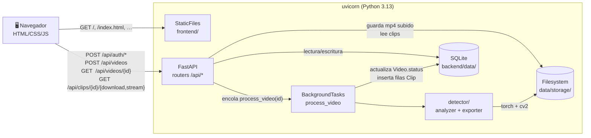
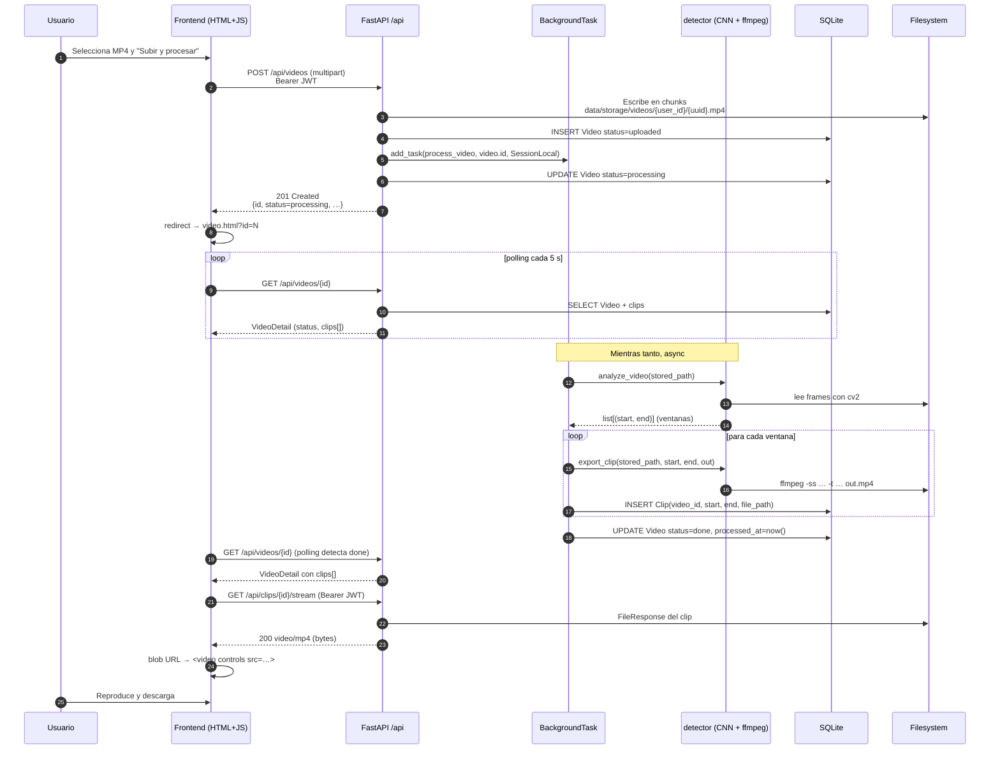
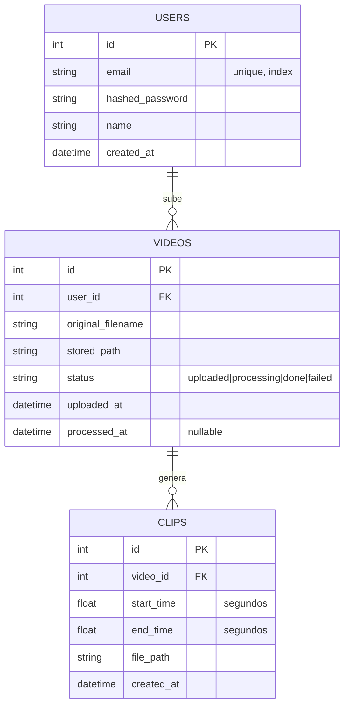

# Arquitectura — ClipCatcher

> Visión técnica del MVP entregable: componentes, flujo end-to-end, modelo
> de datos y límites del diseño actual frente a la arquitectura objetivo.
> Para conocer **qué** quedó fuera y **por qué**, ver
> [`trabajo_futuro.md`](trabajo_futuro.md).

---

## 1. Vista general

ClipCatcher es una aplicación web monolítica donde un único proceso
`uvicorn` sirve la API REST y los assets del frontend. El procesamiento de
vídeo ocurre dentro del mismo proceso, en segundo plano, mediante
`BackgroundTasks` de FastAPI.



---

## 2. Flujo end-to-end de una subida

Secuencia desde que el usuario arrastra un MP4 hasta que reproduce los
clips generados.



Tiempo medido sobre un clip de 30 s a 720p (CPU, sin GPU):

- Subida del MP4 (13 MB en local): **~0.09 s**.
- `analyze_video`: **~2.4 s** (ResNet18 a 1 frame/s con `lru_cache` del modelo).
- `export_clip` (ffmpeg, libx264 preset `fast` + AAC): **~5.5 s**.
- Total end-to-end (subida → `done` con clip generado): **~7 s**.

---

## 3. Modelo de datos

Tres tablas en SQLite, sin migraciones (`Base.metadata.create_all` en el
evento `lifespan`).



Las relaciones se cargan vía `relationship(... cascade="all, delete-orphan")`,
así un `User` borrado se lleva sus `Video`, y cada `Video` borrado se lleva
sus `Clip` (también del filesystem si se hiciera limpieza, pendiente de
implementar).

---

## 4. Componentes del backend

### `backend/app/`

- **`main.py`** — Punto de entrada. Crea la app FastAPI, registra
  middlewares (CORS abierto en dev), declara el `lifespan` que crea las
  carpetas y las tablas, registra los routers bajo `/api`, expone `/health`
  y `/api/health`, y monta `StaticFiles` en `/` apuntando a `frontend/`.
- **`core/config.py`** — `Settings(BaseSettings)` con lectura de
  `backend/.env` y caché vía `lru_cache`.
- **`core/security.py`** — `hash_password` (bcrypt), `verify_password`,
  `create_access_token`, `decode_token`.
- **`core/deps.py`** — `oauth2_scheme` y `get_current_user(token, db)` que
  decodifica el JWT, busca el `User` y lanza 401 si falla.
- **`db/session.py`** — Engine SQLAlchemy con
  `connect_args={"check_same_thread": False}` para SQLite, `SessionLocal`
  como `sessionmaker`, helper `get_db()`.
- **`models/`** — `User`, `Video`, `Clip` con tipado moderno
  (`Mapped[…]` + `mapped_column(...)`).
- **`schemas/`** — `UserCreate`, `UserOut`, `Token`, `VideoOut`,
  `VideoDetail`, `ClipOut`.
- **`api/auth.py`** — `POST /auth/register` y `POST /auth/login` (OAuth2
  password flow).
- **`api/users.py`** — `GET /users/me`.
- **`api/videos.py`** — `POST /videos` (multipart, escritura en chunks de
  1 MiB con corte por `MAX_UPLOAD_BYTES`), `GET /videos`, `GET /videos/{id}`.
- **`api/clips.py`** — `GET /clips/{id}/download` y `GET /clips/{id}/stream`,
  con helper `_get_owned_clip` que centraliza autorización (404 unificado
  para "no existe / no es tuyo") y comprobación de archivo en disco
  (410 Gone si la fila existe pero el archivo se ha perdido).
- **`services/processor.py`** — `process_video(video_id, db_factory)`
  orquesta `analyze_video` + `export_clip` por ventana, gestiona
  transiciones de estado (`uploaded → processing → done|failed`) y
  nunca propaga excepciones (las marca `failed`).

### `backend/detector/`

- **`analyzer.py`** — `analyze_video(path) -> list[tuple[float, float]]`.
  Carga `kill_detector.pt` con `lru_cache`, recorta el ROI del killfeed
  (esquina superior derecha, coords relativas), procesa 1 frame por
  segundo con la CNN binaria, y agrupa detecciones consecutivas dentro
  de `_CHAIN_WINDOW_S = 6.0` s en una sola ventana.
- **`exporter.py`** — `export_clip(path, start, end, out)`. Función pura:
  invoca `ffmpeg` por `subprocess` con `libx264 + AAC`, sin estado global.
- **`model/kill_detector.pt`** — ResNet18 con head binario (43 MB,
  versionado en el repo via excepción explícita en `.gitignore`).
- **`config.json`** — `margen_clip` y `duracion_clip` en segundos.

---

## 5. Frontend

Cuatro páginas estáticas servidas por FastAPI con `StaticFiles`. Sin
build pipeline ni framework: HTML + CSS plano + ES modules.

| Página | Función |
|---|---|
| `/index.html` | Login + registro en pestañas. Persiste el JWT en `localStorage`. |
| `/dashboard.html` | Lista de vídeos del usuario en cards. Empty state. |
| `/upload.html` | Subida con barra de progreso (XHR `onprogress`). |
| `/video.html?id=N` | Detalle con polling 5 s, `<video controls>` por clip, descarga. |

Comunicación con la API vía `js/api.js`:

- Wrapper de `fetch` que añade `Authorization: Bearer $token`.
- Manejo central de 401 → `logout()` automático.
- `XMLHttpRequest` solo para subida (la Streams API no expone progreso de
  upload de forma fiable en todos los navegadores).
- Los clips se reproducen vía `URL.createObjectURL(blob)` porque el
  `<video src>` no permite enviar `Authorization`.

---

## 6. Trade-offs y límites del MVP

| Decisión | Por qué | Límite |
|---|---|---|
| SQLite + `create_all` | Cero configuración para el evaluador | Un proceso, sin migraciones |
| `BackgroundTasks` | Simplicidad, sin Redis | Procesamiento ligado al ciclo de vida del proceso |
| `StaticFiles` en `/` | Sin Nginx | Sin TLS, sin compresión, sin cache controlado |
| JWT email+password | Sin Google Cloud | No SSO |
| Inferencia CPU | Sin GPU drivers | ~25× tiempo real (suficiente para clips cortos) |
| Clips entera-en-memoria en frontend | Limitación de `<video src>` con auth | No streaming Range desde el navegador (sí desde curl/clientes API) |
| Aislamiento por filtro `user_id` | Patrón consistente en todos los GET | Sin RBAC ni roles |

Cada uno de estos puntos tiene su evolución concreta documentada en
[`trabajo_futuro.md`](trabajo_futuro.md). La arquitectura del MVP está
intencionadamente preparada para escalar a la objetivo: SQLAlchemy
abstrae el motor de BD, los routers están desacoplados del transporte,
el detector vive en un paquete autónomo (`backend/detector/`) que ya
podría ejecutarse en un worker independiente con cambios mínimos.

---

## 7. Diagrama del despliegue local

```
┌──────────────────────────────────────────────────────────┐
│                  Máquina del evaluador                   │
│                                                          │
│  ┌──────────────┐      HTTP        ┌──────────────────┐  │
│  │   Navegador  │ ◀──────────────▶ │  uvicorn :8000   │  │
│  │  (Chrome/FF) │                  │                  │  │
│  └──────────────┘                  │  ┌────────────┐  │  │
│                                    │  │ FastAPI    │  │  │
│                                    │  │ /api/*     │  │  │
│                                    │  ├────────────┤  │  │
│                                    │  │ StaticFiles│  │  │
│                                    │  │ frontend/  │  │  │
│                                    │  └─────┬──────┘  │  │
│                                    │        │         │  │
│                                    │  ┌─────▼──────┐  │  │
│                                    │  │ Background │  │  │
│                                    │  │   Tasks    │  │  │
│                                    │  └─────┬──────┘  │  │
│                                    │        │         │  │
│                                    │  ┌─────▼──────┐  │  │
│                                    │  │  detector/ │  │  │
│                                    │  │ ResNet18 + │  │  │
│                                    │  │   ffmpeg   │  │  │
│                                    │  └─────┬──────┘  │  │
│                                    │        │         │  │
│                                    │  ┌─────▼──────┐  │  │
│                                    │  │ data/      │  │  │
│                                    │  │  ├ db      │  │  │
│                                    │  │  └ storage │  │  │
│                                    │  └────────────┘  │  │
│                                    └──────────────────┘  │
└──────────────────────────────────────────────────────────┘
```

Todo en una sola máquina, un único proceso Python, sin contenedores.
El paso a la arquitectura objetivo (Docker Compose con backend, worker,
MySQL, Redis y Nginx separados) está descrito en
[`trabajo_futuro.md`](trabajo_futuro.md).
